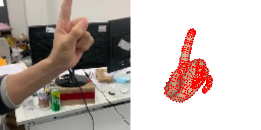
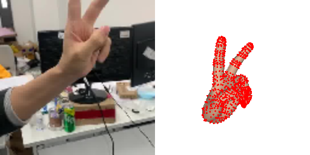
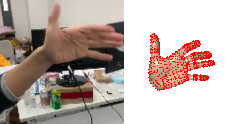

# Minimal-Hand
This is a **unofficial** implementation of Minimal-Hand based on PyTorch(CVPR2020)


This project provides the core components for hand motion capture:

- estimating joint locations from a monocular RGB image (DetNet)
- estimating joint rotations from locations (IKNet)

## DO
- [x] Inference code like [offical one](https://github.com/CalciferZh/minimal-hand)
- [ ] Training code


# Quick Start
## Download
First, you need download detnet and iknet transfered from tensorflow version. Note that there is a bit of precision error when I transfer tensorflow module to pytorch:  
- [Detnet](https://drive.google.com/file/d/1xcnBGLoUO6WT2k9rVnIbRSeJ9YC5RewO/view?usp=sharing)
- [Iknet](https://drive.google.com/file/d/1CRHLO57cnLizuAhGt9QKjlEe-yW5ZAzc/view?usp=sharing)

And then, you need mkdir weights into which you put the weights downloaded from the above websites.

## Inference
```
  python app.py
```
Note that you could choose your video parameters by modify the following code in app.py
```
  live_application(video_stream("../test_video/img_3/"))---> live_application(video_stream("../your_image_files_path"))
```

## Visualization





# Citation
This is the **unofficial** implementation of the paper "Monocular Real-time Hand Shape and Motion Capture using Multi-modal Data" (CVPR 2020).


If you find the project helpful, please consider citing them:
```
@inproceedings{zhou2020monocular,
  title={Monocular Real-time Hand Shape and Motion Capture using Multi-modal Data},
  author={Zhou, Yuxiao and Habermann, Marc and Xu, Weipeng and Habibie, Ikhsanul and Theobalt, Christian and Xu, Feng},
  booktitle={Proceedings of the IEEE/CVF Conference on Computer Vision and Pattern Recognition},
  pages={5346--5355},
  year={2020}
}
```

# Differents between offical code and us
[Link](Different/Different.md)
